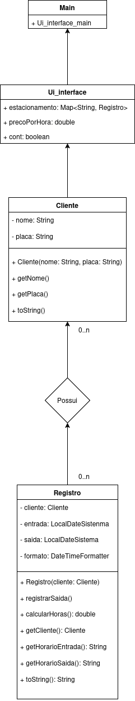

# sistema-de-estacionamento_-sde
Davi gosta de java

```bash
+------------------+
|      Main        |
+------------------+
| + main(args):void|
+------------------+
         |
         |
+-------------------+
|  Ui_interface     |
+-------------------+
| + gerarDadosTeste |
| + buscarPorCpf    |
| + main() : void   |
+-------------------+
         |
         |
+-------------------+          +-----------------------------------+
|     Cliente       |<---------|     Registro                      |
+-------------------+          +-----------------------------------+
| - nome: String    |          | - cliente: Cliente                |
| - placa: String   |          | - entrada: LocalDateTime          |
| - cpf: String     |          | - saida: LocalDateTime            |
| + getNome():      |          | - formato: DateTimeFormatter      |
| + getPlaca():     |          | + Registro(Cliente) : void        |
| + getCpf():       |          | + registrarSaida() : void         |
| + toString() :    |          | + calcularSegundos() : long       |
+-------------------+          | + getCliente() : Cliente          |  
                                | + getHorarioEntrada() : String   |
                                | + getHorarioSaida() : String     |
                                | + toString() : String            | 
                                +----------------------------------+
```


## Imagem UML




## Kanban


